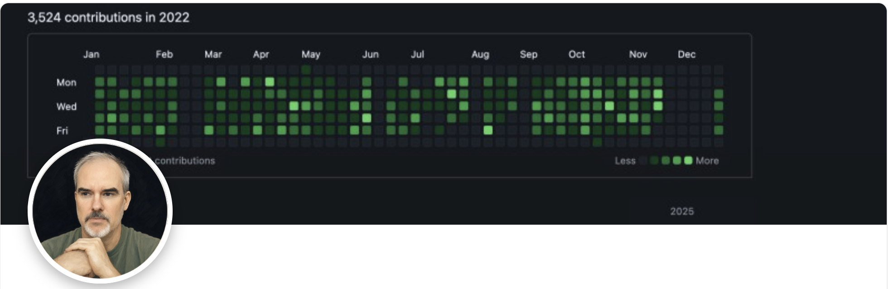

# Thoughts on docs 

I'm Zach Elwood. As part of my [portfolio](/portfolio), these are some thoughts of mine on technical writing and documentation.  

*A boat I saw the other day.*

## What makes documentation good? Are good docs hard or easy to create?

In general, I think strong, effective instructional communication will sometimes be quite easy to create, and sometimes be very difficult to create. I think this fact helps explain the multitude of perspectives on it, with some non-technical-writers thinking "I can do that; it's not that hard," and some technical writers thinking "It takes a specialist to do this well." Both takes can be accurate, depending on the situation and specific project. It also helps us understand different and opposed takes on how AI tools are impacting these jobs. 

What makes documentation effective? Put simply, it solves an audience's problems; it helps them do something. And to help an audience, one must know the domain well enough to understand that audience's common challenges and frustrations (or absorb sufficient knowledge on such things second-hand through SMEs). This helps explain why effective documentation will sometimes be an easy task. A non-writer who knows a domain and customer audience well could theoretically create a simple and quickly written bulletpoint list that is a huge help to that audience. Whereas a professional writer who doesn't know a domain or an audience well might produce highly readable and organized content that doesn't speak to or help that audience at all. 

This is what I mean by saying that creating effective documentation is sometimes quite easy. 

But it can also be difficult. It can be hard to know a given domain well, especially if it's highly complex, and it can be hard to speak in a knowledgeable, accurate, and trustworthy way about it. It can be hard to get to know the particular frustrations and challenges of a given audience in that domain. It can be hard to catch errors in documentation; I've seen docs get rounds of reviews from expert SMEs and still contain major errors and contradictory points. It can be hard to research and interview knowledgable people in the right way to draw out and absorb the things that actually matter to a given audience. People not well versed in creating documentation can struggle with how to organize concepts, the flow of ideas, and the overall site navigation and information architecture (these aren't always major deals but they can be). 

This is what I mean by saying that creating effective documentation is sometimes very hard. 

The fact that effective documentation is sometimes easy to create and sometimes hard to create also helps us understand the very divergent views on the topic of AI tools, and how those tools are impacting documentation-related roles. AI tools will sometimes do a fine job; even when they're doing a far-from-great job, that may be good enough for a company. And often, a domain expert will be able to edit and review the generated text and improve it, and do other docs-related work (e.g., site organization; diagram creation, etc.) that is pretty decent. And, on the other side of the argument, it's also true that AI-generated communications will often be quite bad (especially at more complex tutorials and guides), and have assorted misunderstandings and hallucinations, and it's true that unskilled reviewers will often not be motivated to or able to catch major problems in those resources (just as that happens without AI), and it's true if you build systems on bad foundational documentation, you'll have a big problem. 

I think these are important points as they help us see what really matters in documentation, and help us cut through some of the bullshit, and help us see why people can have such different takes. It's possible for smart, rational people to reach a range of defensible views on how to approach documentation. And sometimes people debating these areas will be talking past each other. 

🎵 I've looked at documentation from both sides now. 🎵 

## Other "thought leadership"

Some writings: 
* [Idea for measuring docs success using tech-support tags and tracking](https://www.linkedin.com/posts/zelwood_there-is-no-great-method-for-measuring-the-activity-7460694978927968257-VDnQ) 
* Tips for tech-writing (and related) job searches:
  * [Ideas for varying search terms and job sites](https://www.linkedin.com/posts/zelwood_some-ideas-for-those-seeking-jobs-in-software-activity-7466123657052913664-s7UY)
  * [Examples of my job applications](https://www.linkedin.com/posts/zelwood_if-youre-a-tech-writer-looking-for-work-activity-7447300315516841984-HY53) including resumes and cover letters 

